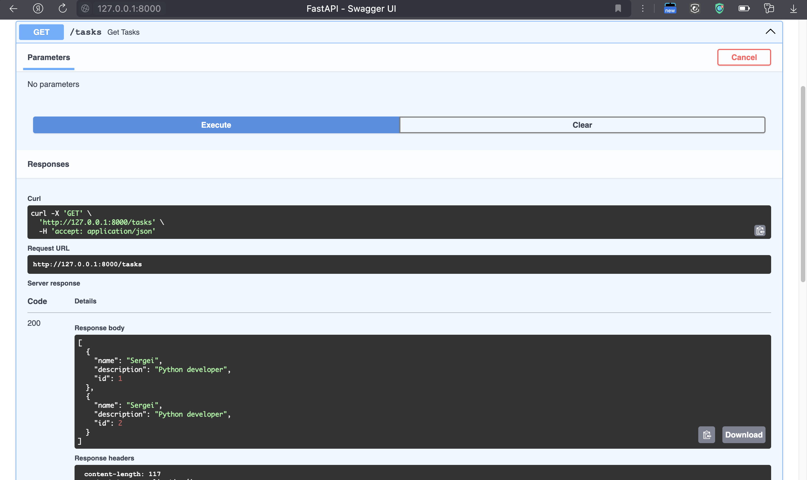

# FastAPI
**Author: Sergei Kalyaev**  
Проект для созданий и скачиваний датабаз

## Описание
В ходе работы я использовал:  
- from fastapi import FastAPI, APIRouter, Depends
- from contextlib import asynccontextmanager
- from sqlalchemy import select
- from typing import Annotated, Optional
- from pydantic import BaseModel, ConfigDict
- from sqlalchemy.ext.asyncio import create_async_engine, async_sessionmaker
- from sqlalchemy.orm import DeclarativeBase, Mapped, mapped_column

Файлик `router` получения и добавления датабаз  
`sqlalchemy` (DeclarativeBase) для взаимодействая (Удаление, создание) с датабазами   
`repository.py` для получения таблиц с датабазы
`lifespan` и `main.py` для запуска Web приложения
`schemas.py` для удобства  

## Чтобы запустить 
- git clone `url repository`
- pip install FastAPI uvicorn sqlalchemy aiosqlite greenlet
- cd FastAPI
- uvicorn main:app

## Стэк 
-   
-   
-   

## Скрины  
  
   
  
